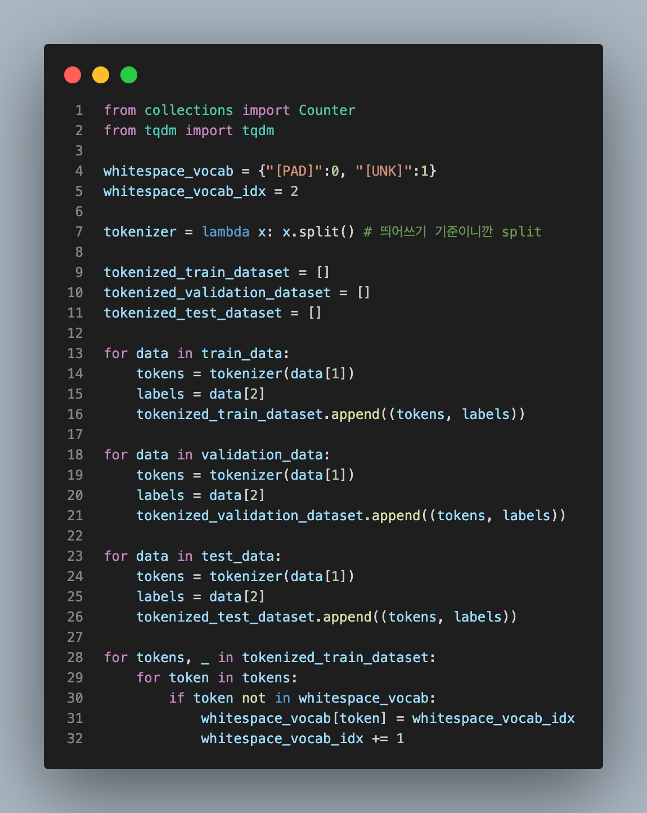
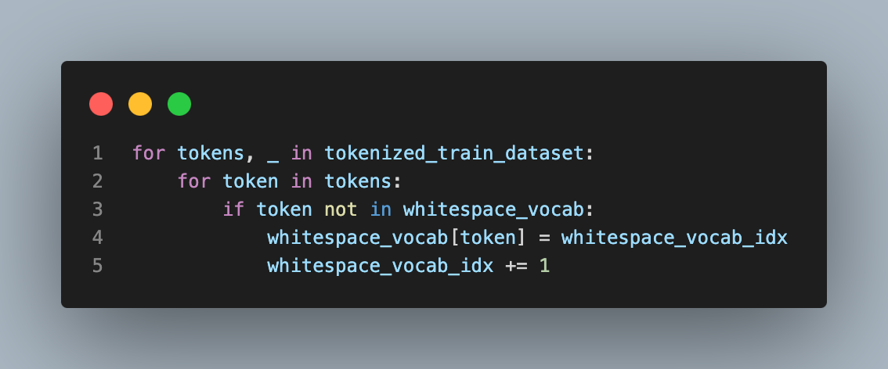

# NLP Assignment1

2019136009 곽재우

## 1. 영어로된 영화 리뷰 데이터 전처리 (40점)

-   Kaggle에서 제공하는 Movie Review Dataset(https://www.kaggle.com/datasets/vipulgandhi/movie-review-dataset?resource=download)를 전처리하여 Vocab을 구성하시오.

    -   제공되는 코드는 해당 데이터를 실습에 사용한 NSMC 데이터의 형식으로 바꾸어주는 코드이다.
        -   단, 실습과 달리 train, val, test의 세 부분으로 나누어짐
    -   Vocab 구성시 Whitespace tokenizer를 사용하여야 하며, Data cleaning, Text cleaning 과정을 거치지 않은 기본 Vocab을 생성하시오

**GRADING**

-   Vocab 구현에 성공(+40)

### 훈련, 검증, 테스트 데이터 구성


데이터를 출력해보면 아래와 같이 id, text, label 컬럼으로 구성되어 있다.


train_data, validation_data, test_data로부터 (id, text, label) 데이터를 꺼내서 (token, label) 형태로 `tokenized_dataset`에 저장해준다.



### whitespace_vocab 생성

데이터로부터 whitespace_vocab을 생성한다.



생성한 whitespace_vocab을 확인해보자.


## 2. 영어로된 영화 리뷰 데이터 분류 모델 학습 (30점)

-   실습에 사용한 모델 및 Dataset 객체를 통해 긍정 부정 분류 모델을 학습하시오.
    -   실습코드와 동일한 구조의 모델을 사용해야함
    -   실습코드와 동일한 Trainer 및 하이퍼 파라미터를 유지해야함
    -   Train, Validation, Test 데이터를 모두 학습에 알맞게 사용할 것

**GRADING**

-   모델 구현 및 학습 (+25)
-   Train, Validation, Test를 알맞게 사용 (+5)

### 실습에 사용한 모델 정의

먼저 `SentimentClassifier`를 정의해준다.


Pytorch Lightning Module에 맞게 `SentimentClassifierPL`도 정의해준다.


### Dataset 정의

`SentimentDataset`도 정의한다.


### vocab 메서드 정의

그리고 vocab의 크기와 단어들을 확인하는 `check_vocab_properties`와

훈련과 검증 및 테스트를 수행하는 `check_performance` 메서드를 정의해준다.

이때 `check_performance`는 실습 코드와 다르게 validation_data를 사용하기 때문에 `val_dataset` 부분에 `SentimentDataset`의 파라미터로 `validation_data`를 전달해준다.


### 모델 학습

이제 모델을 훈련과 검증 및 테스트 해본다.


whitespace_vocab은 1.7M 개의 학습 파라미터를 가지고 있다.


훈련 결과는 아래와 같다.


wandb에서 확인한 결과는 아래와 같다.


## 3. Vocab 개선 (30점)

-   상기 구축한 Vocab을 최적화 하여 모델의 성능을 개선하시오
    -   남이 구축한 Vocab을 가져오는 것을 제외, 모든 것을 허용
-   참고하면 좋은 것
    -   영어의 불용어(Stopword) : https://gist.github.com/sebleier/554280
    -   영어에 적합한 Tokenizer : NLTK 라이브러리 참고 (https://www.nltk.org/api/nltk.tokenize.html)
    -   영어의 lemmatizing 및 stemming : NLTK 라이브러리를 참고 (https://www.nltk.org/api/nltk.stem.html)
    -   Regular Expression 사용시 유용한 사이트 : https://regexr.com/

**GRADING**

-   수업에 배운 내용을 적용 (+10)
-   적용된 Vocab을 통해 성능 개선 (+10)
-   NLTK 등 외부 라이브러리의 tokenizer 및 다양한 정규화 기법을 사용 (+10)

### Vocab 최적화

### 등장빈도가 너무 적은 토큰 삭제

Lec02 TextPreprocessing에서 배운대로 먼저 등장빈도가 너무 적은 토큰을 삭제해준다.

그러기 위해서 `Counter()`를 이용해 `tokenized_train_dataset`에 어떤 토큰이 등장빈도가
많고 적은지 알아보자.

먼저 `Counter` 객체를 생성한다.


그리고 가장 많이 등장하는 단어 10개를 출력해보자.


반대로 가장 적게 등장하는 단어 10개도 출력한다.


'bozookas'는 바주카포의 바주카 같은데 실제로 사용하는건 처음 보았다..

단어들의 분포를 그래프로 시각화하였다.


이건 Lec2 TextPreprocessing 실습에서 본 그래프보다 더 극단적이다.

특정 단어만 많이 등장한다. 그리고 나머지 대부분 단어는 등장 빈도가 매우 적은 거 같다.

이걸 유지할 필요는 없다.

따라서, **등장빈도가 적은 단어를 제거해준다.**

등장빈도수가 1인 단어는 제외하고 vocab을 구성한다.


새로운 `min1removed_vocab`을 출력해보자.


기존 whitespace_vocab과 비교해보면 사이즈가 거의 절반으로 줄어들었다.

```python
# 기존 whitespace_vocab
Vocab size: 43031
Vocab items: [('[PAD]', 0), ('[UNK]', 1), ('assume', 2), ('nothing', 3), ('.', 4)]
```

이제 모델을 학습시켜보자.


학습 파라미터가 1.1M으로 크게 줄어들었다.


그리고 test_accuracy도 56%로 크게 향상되었다.


### 불용어 제거

앞서 `Counter` 객체로 가장 많이 등장하는 단어 10개를 출력한 결과 the, a 같은 불용어가 많았었다.

이것들을 제거해주면 vocab에서 의미 없는 단어들이 없어지고 영화 리뷰와 관련된 단어 비중이 늘어나지 않을까? 그러면 학습에도 좀더 좋은 영향을 미칠 것이라고 생각했다.

불용어를 제거하기 위해 NLTK 불용어를 다운로드 해준다.


불용어를 제거해주자.


아까는 the, a, is 등 불용어가 많았는데 모두 제거되어 이제서야 영화와 관련된 film, movie 같은 단어가 나온다.

이제 vocab을 구성해보자


160개 이상의 불용어가 모두 제거되었다.

마찬가지로 훈련시켜보자.


생각보다 큰 변화가 없었다. 그리고 학습을 여러 번 돌려봤는데 51%가 높은 정확도였고

많은 경우 이것보다 낮은 정확도가 나왔다.

처음에는 불용어를 제거하면좋은 성능을 낼 것이라고 생각했는데 아니었다.

이것에 대한 생각을 4번에 정리하였다.

### Lemmatizing (NLTK tokenizer 사용)

불용어 제거로 눈에 띄는 성능 향상이 보이지 않아서 수업 시간에 배운 Lemmatizing도 적용해보았다.

먼저 불용어를 제거하지 않은 데이터부터 다시 시작하자. 앞서 불용어를 제거한 경우 큰 효과를 못 보아서 이번에는 불용어를 둔 채로 Lemmatization을 한다.


NLTK에서 wordnet과 Lemmatization에 필요한 패키지를 추가로 다운받는다.


그리고 Lemmatization을 해줄 때 품사에 따라`pos`를 지정해주어야 한다.

따라서 단어의 품사를 확인하여 그것에 알맞는 `pos`값을 주도록 코드를 구성하였다.


기존에는 is였는데 be로 lemmatization을 수행한 모습이다.

이제 vocab을 구성해보자.


각 단어들을 표제어로 변환시키면서 단어 수가 조금 줄어들었다.

이제 vocab 성능을 테스트해보자.


Lemmatization 또한 큰 성능 변화가 없었다.

## 4. 왜 Vocab에 따라 성능이 달라지는가? (Bonus 20점)

-   실습 및 과제를 통해 Vocab에 따라 성능이 차이남을 확인할 수 있음
-   왜 성능이 하락하는지에 대한 자신의 생각을 기술하시오

**GRADING**

-   자신의 생각을 기술 함 (+10)
-   자신의 생각에 근거를 제시함 (+10)

흰트 : Vocab은 **Train 데이터를 통해서 구축**하여 Train, Validation, Test 데이터셋 모두에 사용함 + 단어가 Vocab에 없다면 **Unknown token**을 그자리에 대체함

주의! 흰트로 추론 가능한 이유 이외에도 다양한 이유가 존재. 자유롭게 기술

먼저 wandb에 기록한 4가지 Case를 살펴보자.


-   whitespace_vocab: 기본 vocab, test_accuracy: 51%
-   whitespace_min_count_1: 기본 vocab에서 등장빈도가 1인 단어 제거, test_accuracy: 56%
-   no_stopword_vocab: 불용어를 제거한 vocab, test_accuracy: 52%
-   lem_vocab: Lemmatization한 vocab, test_accuracy: 54%

기본 vocab이 가장 낮았고 whitespace_min_count_1이 가장 높았고 no_stopword_vocab이나 lem_vocab은 사실 훈련을 돌릴 때마다 다르게 나와서 큰 차이는 없다고 봐도 무방했다.

여기서 눈여겨볼만한 점은, 불용어를 제거한 vocab이 높은 성능을 보일 것으로 예상했지만 실제로는 그렇지 않았다는 것이다.

내가 생각한 이유는 아래와 같다.

우선 Vocab의 크기와 모델의 성능과 관련이 있다고 생각한다.

이번 과제를 진행하면서 다양한 기법을 적용하다보니 vocab의 크기 역시 줄어들었다.

vocab의 크기가 작으면 문제에 특화된 핵심 정보를 유지할 수 있지만, 정보를 세분화해서 표현할 수 없게 된다.

또한 OOV문제도 나타난다. 결국 절대적인 vocab 크기가 작다면 inference에서 vocab에 존재하지 않는 단어를 만날 수 밖에 없다.

그래서 앞서 불용어를 제거하는 것과 같이 vocab을 최적화해보았지만 성능에 크게 변화가 없는 이유는,

주어진 데이터뭉치에서 불용어들이 차지하는 비율 자체가 높다보니 불용어를 제거한 vocab으로 훈련해보면 OOV 문제가 심해질 것이라고 생각했다. (불용어가 차지하는 비율이 높은 것은 앞서 `Counter`의 `most_common` 메서드를 통해 살펴보았다)

또한 데이터셋의 구성 문제도 생각해보았다. 데이터셋은 기본적으로 train, validation, test로 분할한다.

보통 7:1.5:1.5 (아니면 이것보다 조금 낮거나 높은 비율로 조절해서) 분할하는데 이때, train 데이터셋에서 많이 보였던 단어가 validation, test 데이터셋에는 거의 나오지 않을 수도 있는 것이다. 반대로 말하면 train 데이터셋에서는 한 번도 보지 못했던 단어가 validation, test 데이터셋에는 여러 번 나올 수 있는 것이다.


이런 데이터셋 구성 문제로 훈련이 제대로 되지 않았을 가능성도 있다.

마지막으로 훈련 세팅과 관련한 문제도 있다고 생각한다. epoch가 1이기 때문에 충분히 학습이 되지 않았을 수 있기 때문이다.


그렇다고 어떤 하나의 문제가 확실한 원인이라고 찝어서 얘기하는 것은 어려운 일이다. 위와 같이 종합적인 원인이 뭉쳐서 accuracy에 영향을 미치기에 딥러닝을 기반으로 NLP 분야 역시 참 어렵다.
