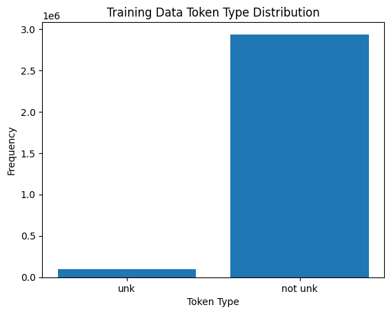
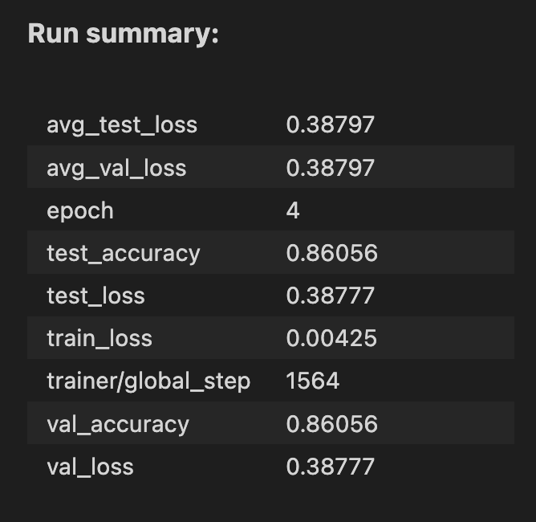

# NLP Assignment 2

-   작성일자: 2024년 4월 8일 월요일
-   작성자: 곽재우

## 1. IMDB 데이터 처리 (20점)

-   Stanford 대학에서 제공하는 IMDB 영화 리뷰 데이터(https://ai.stanford.edu/~amaas/data/sentiment/)를 다운 받아 학습, 테스트 데이터를 구성하시오
    -   데이터는 영어 텍스트 데이터로 긍정/부정의 Binary classification 데이터셋임
    -   데이터셋의 압축을 해제했을 떄의 각 디렉토리의 용도는 다음과 같음
    -   train/pos : 긍정 label의 학습 데이터
    -   train/neg : 부정 label의 학습 데이터
    -   test/pos : 긍정 label의 테스트 데이터
    -   test/neg : 부정 label의 테스트 데이터
    -   지금껏 배운 다양한 기법을 적용해 tokenizing, nomalizing 등을 진행한 후 vocab을 구축하여야함

**GRADING**

-   데이터셋 전처리를 통해 vocab 구축 (+20)

### 1.1 데이터셋 전처리

_데이터셋은 aclImdb_v1.tar.gz 압축 파일을 Colab 환경에 업로드하여 사용하였습니다._

사용한 전처리 기술

-   HTML 태그 제거
-   불필요한 문장부호 제거
-   소문자로 변환
-   불용어 제거
-   Stemming

```python
import re
from nltk.corpus import stopwords
from nltk.stem import PorterStemmer

stop_words = set(stopwords.words('english'))
st = PorterStemmer()

tokenized_train_dataset = []

# train
# 긍정 리뷰에 대해 불필요한 문자 제거
for data in pos_reviews:
    text = re.sub(r'<[^>]+>', '', data)  # HTML 태그 제거
    text = re.sub(r'[^\w\s]', '', text) # 불필요한 문자 제거 (문장부호만)
    tokens = word_tokenize(text)
    tokens = [token.lower() for token in tokens] # 소문자로 변환
    tokens = [word for word in tokens if word not in stop_words] # 불용어 제거
    tokens = [st.stem(word) for word in tokens] # stemming
    labels = 1
    tokenized_train_dataset.append((tokens, labels))

# 부정 리뷰에 대해 불필요한 문자 제거
for data in neg_reviews:
    text = re.sub(r'<[^>]+>', '', data)  # HTML 태그 제거
    text = re.sub(r'[^\w\s]', '', text) # 불필요한 문자 제거 (문장부호만)
    tokens = word_tokenize(text)
    tokens = [token.lower() for token in tokens] # 소문자로 변환
    tokens = [word for word in tokens if word not in stop_words] # 불용어 제거
    tokens = [st.stem(word) for word in tokens] # stemming
    labels = 0
    tokenized_train_dataset.append((tokens, labels))

len(tokenized_train_dataset)
```

### 1.2 Vocab 구축

`min_count = 2`로 하여 vocab을 구축한다.

```python
from collections import Counter

token_counter = Counter()

for tokens, _ in tokenized_train_dataset:
    token_counter.update(tokens)

# remove tokens that appear only twice or less
min_count = 2
cleaned_vocab = {"[PAD]":0, "[UNK]":1}
cleaned_vocab_idx = 2

for token, count in token_counter.items():
    if count > min_count:
        cleaned_vocab[token] = cleaned_vocab_idx
        cleaned_vocab_idx += 1
```

## 2. 데이터셋 통계 분석 (30점)

-   1에서 처리한 vocab을 통해 tokenizing 된 데이터셋의 여러 통계를 계산하시오

    -   통계의 예시
        -   학습/테스트 문서의 수
        -   학습/테스트 데이터의 평균 token 수
        -   데이터의 token histogram
        -   학습/테스트에서의 unk token의 수
        -   각 token의 빈도 그래프
        -   긍정/부정의 token 빈도 차이
        -   긍정/부정의 frequent/rare token

-   이전 실습까지 사용한 코드 및 검색을 활용하여 최소 1개의 그래프를 그려야 함

**GRADING**

-   분석한 통계의 수 (+5)

### 2.1 학습/테스트 문서의 수

```python
# 학습/테스트 문서의 수
num_train_docs = len(pos_reviews) + len(neg_reviews)
num_test_docs = len(pos_test_reviews) + len(neg_test_reviews)

print("Training 데이터 문서 수:", num_train_docs)
print("Test 데이터 문서 수:", num_test_docs)
```

-   Training 데이터 문서 수: 25000
-   Test 데이터 문서 수: 25000

### 2.2 학습/테스트 데이터의 평균 token 수

-   Training data 평균 token 수: 121.16
-   Test data 평균 token 수: 118.39448


### 2.3 데이터의 token histogram


### 2.4 학습/테스트에서의 unk token의 수

훈련 데이터셋에서 vocab에 존재하지 않는 토큰의 수를 세었다.

```python
count = 0
total = 0
v = []

for tokens, _ in tokenized_train_dataset:
  for token in tokens:
    total += 1
    try:
      v.append(cleaned_vocab[token])
    except KeyError:
      count+=1


print("훈련 데이터에서 unk token 수")
print("unk", count)
print("not unk", len(v))
print("total", total)
print("unk+not unk", count + len(v))
```

훈련 데이터에서 unk token 수

-   unk: 94,125
-   not unk: 2,934,875
-   total: 3,029,000
-   unk + not unk: 3,029,000



테스트 데이터에 대해서도 동일하게 계산한 결과는 아래와 같다.

-   unk: 131,890
-   not unk: 2,827,972
-   total: 2,959,862
-   unk + not unk: 2,959,862


### 2.5 긍정/부정의 token 빈도 차이

각 문서에는 1 또는 0의 레이블이 존재한다. 해당 문서를 토크나이징하여 얻은 토큰에 대해 문서의 레이블이 1이면 토큰 전체를 긍정 토큰으로 인식하였다.

```python
pos_tokens = []
neg_tokens = []
for tokens, label in tokenized_train_dataset:
  for token in tokens:
    if label == 1:
      pos_tokens.append(token)

    else:
      neg_tokens.append(token)

print("pos", len(pos_tokens), "neg", len(neg_tokens))
```

-   긍정(pos) 토큰 수: 1,539,460
-   부정(neg) 토큰 수 1,489,540


### 2.6 긍정/부정의 frequent/rare token

긍정/부정 레이블이 붙어있는 문서에 대해 frequent/rare한 토큰을 분석하였다.

film, movie, one 같은 단어는 비슷한 비율로 긍정/부정 토큰을 구성하고 있는 것을 확인할 수 있다.

해당 통계를 통해 상위 10개 토큰의 빈도를 확인할 수 있다.

```python
pos_token_counter = Counter(pos_tokens)
neg_token_counter = Counter(neg_tokens)

print("Positive Tokens")
print(pos_token_counter.most_common(10))
print("Negative Tokens")
print(neg_token_counter.most_common(10))
```

Positive Tokens

> [('film', 24398), ('movi', 21784), ('one', 13506), ('like', 10091), ('time', 7882), ('good', 7478), ('see', 7251), ('stori', 7187), ('charact', 6867), ('make', 6662)]

Negative Tokens

> [('movi', 27797), ('film', 21897), ('one', 12808), ('like', 11968), ('make', 7835), ('even', 7603), ('get', 7602), ('good', 7233), ('time', 7197), ('watch', 7181)]


-   rare token 확인

```python
# rare token 확인

pos_token_counter = Counter(pos_tokens)
neg_token_counter = Counter(neg_tokens)

print("Positive Tokens")
print(pos_token_counter.most_common()[-10:])
print("Negative Tokens")
print(neg_token_counter.most_common()[-10:])
```

Positive Tokens

> [('athinodoro', 1), ('prousali', 1), ('stavro', 1), ('nikolaidi', 1), ('serieseven', 1), ('tvin', 1), ('ant1', 1), ('zoneswel', 1), ('imi', 1), ('jayden', 1)]

Negative Tokens

> [('resultso', 1), ('afleck', 1), ('giglii', 1), ('parodywith', 1), ('repleat', 1), ('jowl', 1), ('funnythrow', 1), ('camora', 1), ('capich', 1), ('mj', 1)]

## 3. Classification 모델 구축 및 학습 (50점)

-   이론 및 실습 수업을 통해 배운 MLP, CNN, RNN을 사용하여 각자의 모델을 구축하시오
    -   모델의 크기는 ModelSummary 기준 500MB의 메모리를 초과하면 안됨
    -   모델은 최대 10 epoch 학습 할 수 있음 (적게 학습하는 것은 ok)
-   최대한 높은 성능을 기록하는 모델을 구축하여야 함
    -   학습엔 주어진 학습 데이터만을 사용하여야 함
    -   테스트 데이터를 학습에 사용하면 0점
-   모델 구성에 있어 왜 자신이 그런 모델 구조를 설계 하였는지 설명을 하여야함

**GRADING**

-   모델 구축 및 학습 (+20)
-   모델에 대한 설명 (+10)
-   모델 성능에 따른 성적
    -   상위 0~30% : +20
    -   상위 30~50% : +15
    -   상위 50~70% : +10
    -   상위 70~100% : +5

### 3.1 모델 구축 및 학습

#### 3.1.1 모델 구축

가장 성능이 높았던 모델은 TextCNN이다.

```python
class TextCNN(nn.Module):
    def __init__(self, vocab_size):
        super(TextCNN, self).__init__()
        self.SG_embedding = nn.Embedding.from_pretrained(torch.FloatTensor(embedding_loopup_matrix), freeze=True)
        self.RD_embedding = nn.Embedding(vocab_size, 200)

        self.SG_conv1 = nn.Conv2d(1, 200, (3, 200))
        self.SG_conv2 = nn.Conv2d(1, 200, (4, 200))
        self.SG_conv3 = nn.Conv2d(1, 200, (5, 200))

        self.RD_conv1 = nn.Conv2d(1, 200, (3, 200))
        self.RD_conv2 = nn.Conv2d(1, 200, (4, 200))
        self.RD_conv3 = nn.Conv2d(1, 200, (5, 200))

        self.fc = nn.Linear(6*200, 2)


    def forward(self, x):
        SG_embedding = self.SG_embedding(x).unsqueeze(1)
        # 2,1,200,200 -> 채널축을 1로 써줌, cnn쓰기위함
        RD_embedding = self.RD_embedding(x).unsqueeze(1)

        SG_conv1_feature = F.relu(self.SG_conv1(SG_embedding).squeeze(3))
        # 필터로 움직여서 두칸 못움직여서 98
        SG_conv2_feature = F.relu(self.SG_conv2(SG_embedding).squeeze(3))
        # 한칸 못움직여서 97
        SG_conv3_feature = F.relu(self.SG_conv3(SG_embedding).squeeze(3))

        RD_conv1_feature = F.relu(self.RD_conv1(RD_embedding).squeeze(3))
        RD_conv2_feature = F.relu(self.RD_conv2(RD_embedding).squeeze(3))
        RD_conv3_feature = F.relu(self.RD_conv3(RD_embedding).squeeze(3))

        SG_max1 = F.max_pool1d(SG_conv1_feature, SG_conv1_feature.size(2)).squeeze(2)
        SG_max2 = F.max_pool1d(SG_conv2_feature, SG_conv2_feature.size(2)).squeeze(2)
        SG_max3 = F.max_pool1d(SG_conv3_feature, SG_conv3_feature.size(2)).squeeze(2)

        RD_max1 = F.max_pool1d(RD_conv1_feature, RD_conv1_feature.size(2)).squeeze(2)
        RD_max2 = F.max_pool1d(RD_conv2_feature, RD_conv2_feature.size(2)).squeeze(2)
        RD_max3 = F.max_pool1d(RD_conv3_feature, RD_conv3_feature.size(2)).squeeze(2)

        x = torch.cat([SG_max1, SG_max2, SG_max3, RD_max1, RD_max2, RD_max3], dim=1)

        x = self.fc(x)

        return x

        # cnn을 쓰면 파라미터 용량은 줄어들지만 성능 하락?
```

#### 3.1.2 모델 학습

아래와 같이 모델을 선언하고 학습시킨다.

```python
textcnn_model = TextCNN(len(cleaned_vocab))

check_performance(textcnn_model, cleaned_vocab, tokenized_train_dataset, tokenized_test_dataset, "textcnn")
```

#### 3.1.3 모델에 대한 설명

TextCNN 모델의 구조는 아래와 같다.

1. 임베딩 레이어(Embedding Layer)

    - embedding_lookup_matrix를 이용하여 토큰에 대한 임베딩을 생성한다.
    - Skip-Gram 임베딩은 중심 단어로부터 주변 단어를 예측하는 식으로 작동하기 때문에, 문맥을 기반으로 단어의 의미를 학습한다.
    - Random Distributed 임베딩은 단어에 대한 임베딩을 임의로 초기화하여 학습 데이터를 통해 단어 간의 의미 관계를 학습하며 조정하는 방식이다.

2. 컨볼루션 레이어(Convolutional Layer)

    - SG 임베딩을 입력으로 하는 SG_conv1, SG_conv2, SG_conv3이 존재한다.
    - 마찬가지로 RD 임베딩을 입력으로 하는 RD_conv1, RD_conv2, RD_conv3이 존재한다.
    - 컨볼루션 레이어에 SG 임베딩과 RD 임베딩이 모두 존재하는 이유는 다음과 같다
    - SG, RD 임베딩은 의미 정보를 서로 다르게 잡아낸다. SG 임베딩은 문맥 정보를 바탕으로 하는 반면, RD 임베딩은 특정 잠재 의미 관계를 잡아낼 수 있다 (무작위로 초기화하기 때문에)
    - 따라서 두 임베딩을 같이 사용하여 다양한 의미 표현을 잡아낼 수 있다.

3. 풀링 레이어(Pooling Layer)

    - Max Pooling을 사용하여 컨볼루션 레이어의 출력 필터 맵을 지나가며 가장 큰 값을 추출한다.

4. 완전 연결 레이어(FCN, Fully Connected Layer)

embedding_lookup_matrix는 아래와 같으며 vector_size는 200으로, window_size는 10으로 정의하였다.

vector_size가 200이므로 위의 TextCNN 모델의 hidden size도 그에 맞게 200으로 변경해주었다.

```python
from gensim.models import Word2Vec

# call CBOW or SkipGram
# CBOW_W2V = Word2Vec(sentences = word2vec_train_datas, vector_size = 32, window = 5, min_count = 1, workers = 4, sg = 0)
SkipGram_W2V = Word2Vec(sentences = word2vec_train_datas, vector_size = 200, window = 10, min_count = 1, workers = 4, sg = 1)
```


SkipGram Word2Vec에서 보편적으로 많이 사용하는 vector size는 100~300이고 window size는 5~10이므로 해당 범위 안에 있는 값으로 여러번 테스트 하였다.

그 결과 vector size가 200, window가 10일 때 86%의 test accuracy를 기록하여 해당 값을 설정하였다.

#### Test accuracy


wandb


모델 구조



